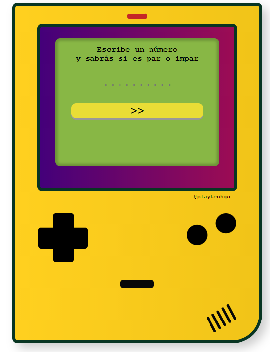

# Calculadora de par/impar retro 🎮
# Estilo Consola Gameboy

## Objetivo
#### Cuando se empieza a aprender programación, se suelen hacer ejercicios de matemática para poder trabajar con variables y datos 👨‍💻. Sin embargo, a veces pareciera que aprendemos las cosas por separado: la estructura de una web general con HTML junto a los estilos en CSS por un lado, y la lógica de programación en un lenguaje como Javascript por el otro 😫. 
#### En este ejercicio colaborativo, queríamos usar la "simple" fórmula para entender cuándo un número es par o impar, dentro de una interfaz digital que invite al juego y a lo lúdico✨. 
#### En esta consola estilo Gameboy, no solo afinamos la variedad de alternativas que puede generar un algoritmo matemático, sino que mejoramos el proceso de usabilidad de un pequeño producto digital desde una perspectiva UXUI, que llame la atención a la persona usuaria, que les resulte sencillo, fácil y les intrigue a probarlo💖. 
### ¿Te gustaría saber si un número es par o impar de una forma más linda y divertida?

#### Probalo en el siguiente link ⬇⬇⬇⬇⬇⬇

<a href="https://playtechgo.com/tech/consola-gameboy/">Calculadora par-impar estilo Gameboy</a>

### Realizado con 💖 por <a href="https://www.linkedin.com/in/dianaledist/">Diana Leonor Di Stefano</a> y <a href="https://www.linkedin.com/in/saul-roldan">Saúl Roldán Yusta</a>

### **[disatechgo](https://disatechgo.com/)**

### **[playtechgo](https://playtechgo.com/)**

### <a href="mailto:disatechgo@gmail.com">disatechgo@gmail.com</a>
